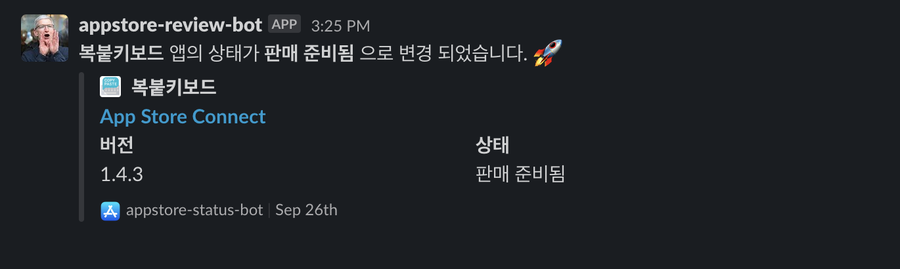

[English Document](./README.md)  

# 소개 🤷🏻‍♂️
App Store Connect status bot 은 앱스토어에 올라가 있는 나의 앱 심사 상태를 가져와 슬랙으로 메세지를 전송해주는 간단한 봇 입니다. 개인앱의 심사 상태를 체크하고 싶거나 팀원들에게 앱의 심사 상태를 공유하고 싶을때 사용하기 좋게 만들었습니다.   `github-actions` 를 사용하였으며 fastlane 의 [Spaceship](https://github.com/fastlane/fastlane/tree/master/spaceship) 라이브러리의 도움을 받았습니다. 사용을 하시려면 해당 레포지토리를 `Fork` 하시면 됩니다. 참 쉽죠? 

# 추가된 기능들 🍯
- 🚀  앱스토어 커넥트 API를 사용하여 앱스토어 정보를 가져옵니다.
- 📣  앱의 심사상태를 슬랙을 통해 공유할 수 있습니다.
- 🌍  다국어가 지원됩니다. (영어 , 한국어)

# 미리보기 🤖

# 사용법 👨🏻‍💻

## 1. API를 호출하기 위해서는 토큰을 먼저 생성합니다. 
`KEY ID` 를 얻기 위해서는 먼저 [App Store Connect](https://appstoreconnect.apple.com/) 에 접속합니다.

1. `사용자 및 액세스`를 선택하고, `키` 탭을 선택합니다. 
2.  새로운 API키를 생성합니다.
3. `키 ID` 를 선택해서 복사 해둡니다.
4. `Issuer ID` 도 선택해서 복사를 해둡니다.
5.  생성된 `API Key file (.p8)` 을 다운로드 합니다.
  > ⚠️ 페이지를 새로고침하면 다시 다운로드 할 수 없으니 주의해주세요! 

## 2. 사전 준비 
6. 슬랙 Webhook URL 발급 받습니다. 
7. 해당 레포지토리를 Fork 합니다.

## 3. `Secrets` 설정하기

- 깃헙 레포 페이지에서 `Settings` - `Secrets and variables` - `New repository secret` 로 들어가서 위에서 복사한 정보들을 세팅해줍니다.

### 복사해야하는 정보들

> PRIVATE_KEY: 다운로드한 `key file(.p8)`을 텍스트로 열어서 복사한후 넣어주시면 됩니다.  
> KEY_ID : `키 ID`를 이곳에 입력합니다.  
> ISSUER_ID : `Issuer ID`도 이곳에 입력합니다.   
> BUNDLE_ID : 상태를 확인하고 싶은 앱의 `bundle identifier` 을 입력해줍니다. (공백 없이 콤마로 구분하시면 2개이상의 앱도 가능합니다.)
> SLACK_WEBHOOK :  슬랙 Webhook URL을 넣어줍니다.  
> DISCORD_WEBHOOK : 디스코드 Webhook URL을 넣어줍니다. (optional)  
> GH_TOKEN: 깃헙 토큰을 넣어줍니다 (`gists` 와 `repo` 권한이 필요합니다 )  
> GIST_ID: gist파일을 생성하고 URL에 존재하는 키값을 복사해서 넣어줍니다.  
  - https://gist.github.com/techinpark/**9842e074b8ee46aef76fd0d493bae0ed**

## 4. 언어 설정 및 탐색 주기 설정

- [fetch.yml](./.github/workflows/fetch.yml) 

`workflow` 파일 내부에서 언어 설정 및 스케줄 시간을 설정 하실 수 있습니다. 기본값은 `15분` 단위로 되어있습니다.

# 레퍼런스 🙇🏻‍♂️

- https://github.com/fastlane/fastlane/tree/master/spaceship
- https://github.com/erikvillegas/itunes-connect-slack
- https://github.com/rogerluan/app-store-connect-notifier

# 기여하기 
- 오픈소스이므로 모든 PR은 환영합니다. 🤩
