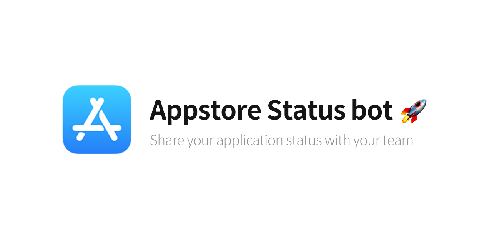
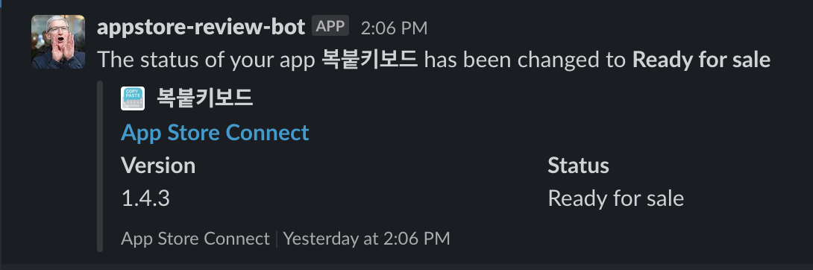

[한국어로 보기](./README-KOREAN.md) 

# Introduce 🤷🏻‍♂️
App Store Connect status bot is a simple bot script fetches your app info directly from App Store Connect and post changes in slack as a bot using `github-actions`, help of fastlane [Spaceship](https://github.com/fastlane/fastlane/tree/master/spaceship)
For using this bot, Just `fork` this repository is Super Easy

# Features 🍯
- 🚀  Fetch appstore connect info using apppstore connect API 
- 📣  Share your application `status` information to your slack workspace 
- 🌍 `Localization` support  (`english`, `korean`) 

# Preview 🤖

# Usage 👨🏻‍💻

## 1. Generating Tokens for API Requests 
To get your Key ID, copy it from App Store Connect by logging in to [App Store Connect](https://appstoreconnect.apple.com/), then: 

1. Select Users and Access, then select the API Keys tab. 
2. The key IDs appear in a column under the Active heading. Hover the cursor next to a key ID to display the Copy Key ID link. 
3. Click Copy Key ID and paste it. 
4. Click Copy Issuer ID and paste it.
5. Download the newly created API Key file (.p8)
  > ⚠️ This file cannot be downloaded again after the page has been refreshed

6. Generate Slack Webhook token. 
7. Fork this repository.

## 3. Setting Secrets with your keys.

- Go to `Settings` - `Secrets and variables` - `New repository secret`

### Secret Values 

> PRIVATE_KEY: Input raw data about your API Key file (.p8)  
> KEY_ID : Input Appstore connect `key_id`  
> ISSUER_ID : Input Appstore connect `issuer_id`   
> BUNDLE_ID : Input your bundle_identifier of application you can input multiple bundle_id with comma and no whitespace   
> SLACK_WEBHOOK :  Input your slack webhook url   
> DISCORD_WEBHOOK : Input your discord webhook url (optional)  
> GH_TOKEN: Input your github token, (need `gists` and `repo` scope).   
> GIST_ID: Input portion from your gist url:
  - https://gist.github.com/techinpark/**9842e074b8ee46aef76fd0d493bae0ed**

## 4. Configure fetch timing or languages

- [fetch.yml](./.github/workflows/fetch.yml) 

In `workflow` file, can change lanauges and fetch schedule default `schedule` is every 15 minutes. 

# References 🙇🏻‍♂️

- https://github.com/fastlane/fastlane/tree/master/spaceship
- https://github.com/erikvillegas/itunes-connect-slack
- https://github.com/rogerluan/app-store-connect-notifier

# Contribution 
- Feel free to contribution for this project. 
- Every `PR`, `Issues` is wellcome. 🤩
